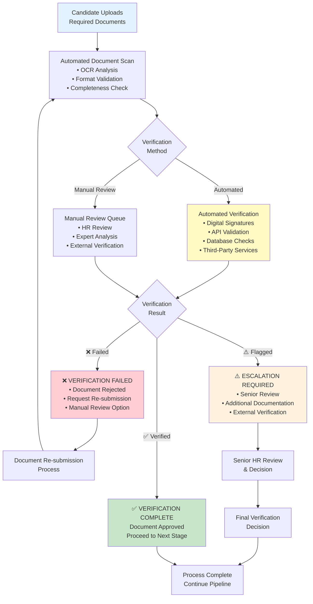
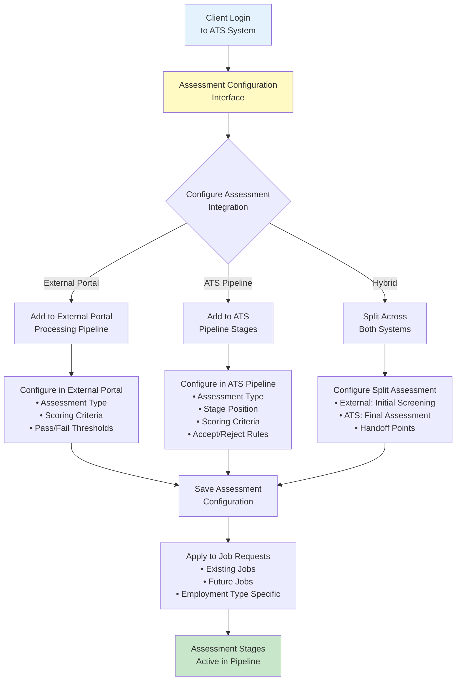
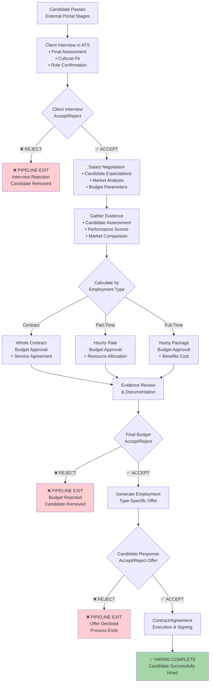
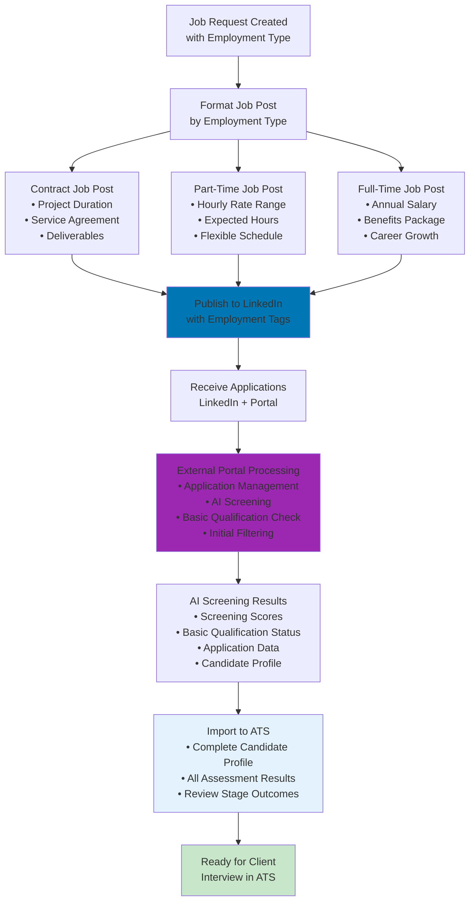

# ATS System Flow Brief - Client Requirements

**Date:** November 12, 2025  
**Document Type:** Technical Requirements Brief  
**Version:** 1.0  
**Status:** Client Specification Document

---

## Executive Summary

This brief outlines the specific workflow requirements for the Multi-Employment ATS System based on client specifications. The system focuses on job request management with employment type-specific flows, external candidate portal integration, and comprehensive budget approval processes.

---

## Core System Architecture

### Job Request Management System

#### Job Request Creation & Management
- **Editable Job Requests:** All job requests remain fully editable throughout their lifecycle, including after being raised/posted
- **Dynamic Pipeline Stages:** Pipeline stages can be modified even after job posting to accommodate changing requirements
- **Employment Type Fields:** Job requests contain employment-specific fields that determine workflow routing and approval processes

#### Key Features:
1. **Persistent Editability:** Job requests and their pipelines can be modified at any stage with automatic LinkedIn sync
2. **Field Customization:** Employment type selection drives field availability and validation rules
3. **Pipeline Flexibility:** Hiring stages can be added, removed, or reordered based on specific job requirements
4. **LinkedIn Auto-Update:** All job request edits automatically push updates to LinkedIn job posting

---

## LinkedIn Integration System

### Automatic Job Posting & Real-time Sync
- **Post-Creation Posting:** Job requests automatically post to LinkedIn after job creation
- **Real-time Edit Synchronization:** Any job request edits in ATS automatically update the LinkedIn job posting
- **Employment Type Formatting:** Job descriptions formatted based on employment type (contract, part-time, full-time)
- **Bi-directional Synchronization:** Job status, edits, and updates sync between ATS and LinkedIn in real-time
- **Application Routing:** LinkedIn applications automatically route to external portal for processing

### LinkedIn Job Management Features:
1. **Automated Posting:** Jobs post to LinkedIn immediately after job request creation
2. **Real-time Edit Sync:** Job request edits in ATS automatically update LinkedIn posting (title, description, requirements, employment type, etc.)
3. **Template Optimization:** Employment type-specific job posting templates for LinkedIn
4. **Application Integration:** LinkedIn applicants flow directly to external portal via ATS routing
5. **Status Synchronization:** Job closing/pausing/reopening reflects on LinkedIn automatically
6. **Pipeline Edit Sync:** Changes to hiring pipeline stages can optionally update LinkedIn job descriptions
7. **Performance Tracking:** LinkedIn application metrics integrated into ATS analytics

### LinkedIn Edit Synchronization Details:

#### Automatic Sync Fields:
- **Job Title:** Updates LinkedIn post title immediately
- **Job Description:** Syncs full description including requirements and responsibilities
- **Employment Type:** Updates LinkedIn employment classification tags
- **Salary Range:** Modifies compensation information (if disclosed)
- **Location:** Updates job location and remote work options
- **Experience Level:** Adjusts seniority level requirements
- **Skills & Requirements:** Updates required and preferred qualifications

#### Manual Sync Options:
- **Company Branding:** Optional sync of company-specific messaging
- **Application Instructions:** Custom application process details
- **Pipeline Information:** Optional inclusion of hiring process overview

#### Sync Timing:
- **Immediate:** Critical fields (title, description, status) sync within 5 minutes
- **Batched:** Non-critical updates sync every 30 minutes
- **Manual Override:** Users can force immediate sync for urgent changes

## External Portal / Candidate Portal Integration

### External Portal Processing System (Candidate Portal)
**Note:** The External Portal and Candidate Portal are the same system - candidates access their application status and interact through the external portal interface.

- **Initial Processing Only:** External portal handles application management and AI screening stages
- **AI Screening Results:** External portal provides AI screening results and basic candidate qualification data
- **Pre-Screened Candidates:** External portal handles candidate application and initial AI-based screening only
- **Screening Results Import:** ATS receives AI screening results and candidate profile data from external portal
- **Client Review in ATS:** All client review stages (assessments, interviews, evaluations) are configured and managed within ATS pipeline
- **ATS Pipeline Management:** ATS handles client-configured assessment stages, client interviews, budget approval, offer generation, and contract execution

### External Portal Candidate Interface & Interaction

#### Pipeline Stage Exposure to Candidates
The ATS system exposes relevant pipeline stage information to candidates through the candidate portal, enabling interactive participation:

#### Candidate-Accessible Stage Information:
- **Current Stage Status:** Real-time visibility into which pipeline stage candidate is currently in
- **Stage Requirements:** Clear description of what's needed from candidate at each stage
- **Action Items:** Specific tasks candidate needs to complete (assessments, scheduling, document submission)
- **Progress Tracking:** Visual progress indicator showing completed and upcoming stages
- **Timeline Information:** Expected duration and deadlines for each stage

#### Interactive Candidate Actions:

**Assessment Stage Interactions:**
- **Assessment Invitations:** Candidates receive notifications to complete required assessments
- **Assessment Portal Access:** Direct links to assessment platforms from candidate dashboard
- **Assessment Scheduling:** Self-service scheduling for time-based assessments
- **Progress Tracking:** Real-time status of assessment completion and results
- **Retake Permissions:** Access to retake assessments if configured by client

**Interview Stage Interactions:**
- **Interview Scheduling:** Self-service interview booking with available time slots
- **Calendar Integration:** Automatic calendar invites and reminders
- **Interview Preparation:** Access to interview guides and preparation materials
- **Reschedule Options:** Ability to reschedule within defined parameters
- **Interview Confirmation:** Confirmation and reminder notifications

**Offer Stage Interactions:**
- **Offer Review Portal:** Secure access to offer documents and terms
- **Offer Discussion Platform:** Communication channel for offer negotiations
- **Document Exchange:** Secure upload/download of offer-related documents
- **Digital Acceptance:** Electronic offer acceptance and signature capabilities
- **Counteroffer Submission:** Platform for submitting counteroffers and negotiations

### Data Flow Architecture:
```
                    LinkedIn Job Posting
                            ↑
Job Request Creation → ATS System → Client Dashboard
                            ↓                     ↑
External Portal / Candidate Portal → ATS System (Client Review Pipeline)
• Application Management                     ↑
• AI Screening                          Custom Assessments
• Candidate Interface                   Client Interviews
• Stage Visibility                      Budget Approval
• Assessment Access                     Offer Generation
• Interview Scheduling                  Contract Execution
• Offer Management
• Document Exchange
```

### External Portal Technical Integration

#### Real-time Pipeline Synchronization
- **Stage Status Updates:** Automatic external portal updates when ATS pipeline stages change
- **Action Notifications:** Immediate alerts when candidate action is required
- **Progress Synchronization:** Real-time progress bar updates as stages complete
- **Status Visibility:** Clear indication of accept/reject decisions and next steps

#### External Portal API Integration
- **ATS Pipeline API:** Real-time access to candidate's current pipeline status and requirements
- **Assessment Integration API:** Direct connection to assessment platforms from external portal
- **Scheduling API:** Integration with calendar systems for interview scheduling
- **Document Management API:** Secure document exchange for offers and contracts
- **Notification API:** Multi-channel notifications (email, SMS, in-app) for stage updates

### Candidate Experience Workflow

#### Stage-by-Stage Candidate Journey:

**1. Application Submitted (External Portal)**
- **External Portal Access:** Unique portal login credentials provided to candidate
- **Initial Status:** "Application Under Review" with progress indicator
- **AI Screening Visibility:** Transparent status of AI screening process

**2. AI Screening Complete**
- **Status Update:** "Screening Passed - Advanced to Client Review"
- **Next Steps Information:** Clear explanation of upcoming assessment/interview stages
- **Timeline Visibility:** Expected timeframe for next stage progression

**3. Assessment Stage (if configured)**
- **Assessment Invitation:** Email/SMS notification with portal link
- **Assessment Dashboard:** Clear instructions, time limits, and requirements
- **Progress Tracking:** Real-time completion status and results (where appropriate)
- **Support Access:** Help desk contact for technical issues

**4. Interview Stage**
- **Scheduling Interface:** Available time slots with interviewer information
- **Preparation Materials:** Interview guides, company information, role details
- **Calendar Integration:** Automatic calendar invites and meeting links
- **Reminder System:** Automated reminders leading up to interview

**5. Offer Stage**
- **Offer Portal:** Secure access to offer documents and compensation details
- **Interactive Review:** Ability to ask questions and request clarifications
- **Negotiation Platform:** Structured communication for offer discussions
- **Digital Acceptance:** Electronic signature and acceptance workflow

---

## Document Verification System

### Automated Document Verification
The ATS system includes comprehensive document verification capabilities to ensure candidate credential authenticity and compliance requirements:

#### Document Types Supported:
- **Identity Documents:** Passports, driver's licenses, national ID cards, social security cards
- **Educational Credentials:** Degrees, diplomas, certificates, transcripts, professional certifications
- **Employment History:** Reference letters, employment certificates, pay stubs, work portfolios
- **Professional Licenses:** Medical licenses, legal bar admissions, technical certifications
- **Background Check Documents:** Criminal background checks, credit reports, drug test results
- **Work Authorization:** Visas, work permits, right-to-work documentation

#### Verification Methods:

**Automated Verification:**
- **Digital Certificate Validation:** Automatic validation of digitally signed documents
- **Institutional API Integration:** Direct verification with educational institutions and certification bodies
- **Government Database Checks:** Integration with official government databases for ID verification
- **Third-Party Verification Services:** Integration with background check and credential verification providers
- **OCR Document Analysis:** Optical character recognition for document authenticity detection
- **Blockchain Verification:** Support for blockchain-based credential verification systems

**Manual Verification Process:**
- **Document Review Queue:** Dedicated interface for HR personnel to review flagged documents
- **Verification Status Tracking:** Real-time status updates on verification progress
- **Expert Review Network:** Access to external verification specialists for complex cases
- **Audit Trail Documentation:** Complete record of verification attempts and outcomes

### Document Verification Workflow

#### Client-Configurable Verification Requirements:
- **Employment Type Specific:** Different verification requirements for contract, part-time, and full-time positions
- **Role-Based Requirements:** Customizable verification criteria based on job sensitivity and requirements
- **Compliance Standards:** Industry-specific compliance requirements (healthcare, finance, government)
- **Geographic Requirements:** Location-based verification needs for different jurisdictions

#### Verification Stage Integration:
- **Pre-Interview Verification:** Document verification as prerequisite for interview scheduling
- **Post-Offer Verification:** Final document verification before contract execution
- **Continuous Monitoring:** Ongoing verification for licenses and certifications with expiration dates
- **Conditional Offers:** Offers contingent on successful document verification

#### Document Verification Pipeline:


### Document Security & Compliance

#### Security Features:
- **Encrypted Storage:** All documents stored with end-to-end encryption
- **Access Control:** Role-based access to sensitive documents
- **Audit Logging:** Complete audit trail of document access and modifications
- **Secure Transmission:** Encrypted document transfer between systems
- **Data Retention Policies:** Configurable document retention and deletion schedules
- **Privacy Protection:** GDPR and privacy regulation compliance

#### Compliance Standards:
- **GDPR Compliance:** European data protection regulation adherence
- **CCPA Compliance:** California privacy law compliance
- **HIPAA Compliance:** Healthcare document handling (when applicable)
- **SOX Compliance:** Financial industry document requirements
- **Industry Standards:** Sector-specific compliance requirements
- **International Standards:** Multi-country regulatory compliance

### Integration with Pipeline Stages

#### Assessment Stage Integration:
- **Credential Verification:** Automatic verification of claimed qualifications before assessments
- **License Validation:** Professional license verification for role-specific requirements
- **Education Confirmation:** Degree and certification validation for technical assessments

#### Interview Stage Integration:
- **Identity Verification:** Confirm candidate identity before interview scheduling
- **Background Check Status:** Verify clean background before interview progression
- **Work Authorization:** Confirm legal work status before final interviews

#### Offer Stage Integration:
- **Final Verification:** Complete document verification before offer generation
- **Conditional Offers:** Offers contingent on pending verification results
- **Onboarding Preparation:** Verified documents ready for HR onboarding process

---

## Pipeline Stage Movement System

### Accept/Reject Based Progression
The ATS system uses a binary Accept/Reject decision model for all stage movements:

#### Stage Movement Rules:
- **✅ ACCEPT:** Candidate moves to the next stage in the pipeline
- **❌ REJECT:** Candidate is immediately removed from the pipeline (process ends)
- **No "Maybe" or "Hold":** All decisions must be definitive Accept or Reject
- **Irreversible Rejections:** Once rejected at any stage, candidate cannot re-enter the pipeline
- **Stage Completion Required:** Each stage must have an Accept/Reject decision before progression

#### Pipeline Exit Points:
1. **External Portal Rejection:** Candidate fails AI screening stage
2. **Document Verification Failure:** Candidate fails document verification or provides fraudulent credentials
3. **Assessment Rejection:** Candidate fails client-configured assessment stages
4. **Client Interview Rejection:** Candidate fails client interview assessment
5. **Budget Approval Rejection:** Candidate's compensation requirements exceed approved budget
6. **Offer Rejection:** Candidate declines the employment offer

#### Decision Accountability:
- **Decision Maker Tracking:** System records who made each Accept/Reject decision
- **Decision Timestamp:** Exact time of each stage decision is logged
- **Reason Code Required:** Rejection decisions must include a reason category
- **Audit Trail:** Complete history of all Accept/Reject decisions maintained

### Customizable Assessment Stages

#### Client-Configurable Pipeline Setup
Clients can configure custom assessment stages that integrate into the candidate pipeline after login:

#### Assessment Stage Configuration Options:
- **Technical Assessment:** Coding tests, technical skill evaluations, project-based assessments
- **Behavioral Assessment:** Personality tests, cultural fit evaluations, work style assessments
- **Skill Verification:** Portfolio reviews, certification validation, practical demonstrations
- **Case Study Analysis:** Business problem-solving, scenario-based evaluations
- **Custom Evaluations:** Client-specific assessment types based on role requirements

#### Assessment Integration Points:
1. **Between External Portal and ATS:** Assessments can be configured as final external portal stage
2. **Within ATS Pipeline:** Assessments can be added as ATS-managed stages before client interview
3. **Parallel Processing:** Multiple assessments can run simultaneously for efficiency
4. **Sequential Requirements:** Assessments can be chained with prerequisite completion

#### Client Setup Interface:
- **Assessment Library:** Pre-built assessment templates by job category and employment type
- **Custom Assessment Builder:** Drag-and-drop interface for creating custom evaluations
- **Scoring Configuration:** Configurable pass/fail thresholds and scoring criteria
- **Integration Settings:** Choose whether assessments run in external portal or ATS
- **Stage Positioning:** Define where assessments fit in the overall pipeline flow

#### Assessment Workflow Configuration:


---

## Employment Type Workflows

### Unified Core Flow
All employment types follow the same core hiring workflow with employment-specific budget approval processes:

#### Core Hiring Stages:
1. **Job Request Creation** (with employment type selection)
2. **LinkedIn Job Posting** (automatic posting after job creation)
3. **Candidate Application** (managed through external portal)
4. **AI Screening Results** (received from external portal)
5. **Document Verification** (automated and manual verification processes)
6. **Custom Assessment Stages** (client-configurable in ATS pipeline)
7. **Client Interview Stages** (client-configurable in ATS pipeline)
8. **Client Review & Evaluation** (all client-defined stages in ATS)
9. **Budget Approval** (employment type-specific, candidate-level)
10. **Offer Generation** (employment type-specific)
11. **Contract/Agreement Execution**
12. **Hiring Completion**

#### Assessment Stage Details:
- **Configurable Position:** Assessments can be placed between any existing stages
- **Multiple Assessments:** Clients can configure multiple assessment types per job
- **Employment Type Specific:** Different assessments for contract, part-time, and full-time roles
- **Accept/Reject Rules:** Each assessment stage follows the same Accept/Reject decision model
- **Pass/Fail Thresholds:** Client-defined scoring criteria for automatic or manual evaluation

#### System Responsibility Division:
- **External Portal Scope:** Application management and AI-based initial screening only
- **ATS Pipeline Scope:** All client review stages including assessments, interviews, evaluations, budget approval, and offer generation
- **Client Control:** Clients configure and manage all review stages within ATS pipeline according to their specific requirements
- **Flexible Configuration:** Clients can setup any combination of assessments, interviews, evaluation stages, budget processes, and offer workflows as needed

---

## Employment Type-Specific Requirements

### 1. Contractual Staff
**Budget Approval:** 
- **Whole Contract Value:** Budget approval required for entire contract duration
- **Service Agreement:** Mandatory service agreement signing process
- **Contract Documentation:** Comprehensive contract management and tracking

**Specific Fields:**
- Contract duration (months/years)
- Total contract value
- Service scope definition
- Deliverable milestones
- Payment schedule

### 2. Temporary/Part-Time Staff
**Budget Approval:**
- **Hourly Payment Structure:** Budget based on hourly rates and estimated hours
- **Flexible Duration:** Open-ended or fixed-term arrangements
- **Resource Allocation:** Department budget allocation for hourly resources

**Specific Fields:**
- Hourly rate
- Expected hours per week/month
- Maximum budget allocation
- Department cost center
- Duration estimate

### 3. Regular/Full-Time Staff
**Budget Approval:**
- **Yearly Package:** Annual compensation package approval
- **Benefits Inclusion:** Total cost including benefits and overhead
- **Long-term Budget Impact:** Multi-year financial commitment consideration

**Specific Fields:**
- Annual salary
- Benefits package details
- Total cost of employment
- Budget year allocation
- Department headcount impact

---

## Candidate-Level Budget Approval Process

### Evidence-Based Approval System
Budget approvals occur at the candidate level after client review stages, requiring documented evidence and justification for each specific candidate:

#### Required Documentation:
1. **Candidate Assessment:** Performance scores and evaluation results
2. **Salary Negotiation:** Candidate expectations vs. job budget parameters
3. **Business Justification:** Clear rationale for hiring this specific candidate
4. **Budget Impact Analysis:** Financial implications and funding source for the candidate
5. **Comparative Analysis:** Market rate comparison for the candidate's experience level
6. **ROI Projection:** Expected return on investment for this specific hire
7. **Approval Chain Documentation:** Complete audit trail of candidate-specific approval process

### Candidate Budget Approval Workflow with Accept/Reject Stages:


### LinkedIn Integration Workflow:


### Complete Candidate Flow with Accept/Reject Stage Movement:

```mermaid
flowchart TD
    JOB_POSTED[Job Posted on LinkedIn<br/>& External Portal Active] --> APPLICATIONS[Candidate Applications<br/>All Sources → External Portal]
    
    APPLICATIONS --> EXTERNAL_PROCESSING[External Portal Processing<br/>• Application Management<br/>• AI Screening<br/>• Basic Qualification Check<br/>• Initial Filtering Only]
    
    EXTERNAL_PROCESSING --> PORTAL_DECISION{AI Screening<br/>Accept/Reject}
    
    PORTAL_DECISION -->|❌ REJECT| PORTAL_REJECTION[❌ PIPELINE EXIT<br/>AI Screening Failed<br/>Candidate Removed]
    PORTAL_DECISION -->|✅ ACCEPT| RESULTS_TRANSFER[Transfer AI Screening Results<br/>to ATS System]
    
    RESULTS_TRANSFER --> ATS_RECEIVES[ATS Receives<br/>• Candidate Profile<br/>• AI Screening Scores<br/>• Basic Application Data<br/>• Qualification Status]
    
    ATS_RECEIVES --> DOCUMENT_VERIFICATION[Document Verification Stage<br/>• Credential Validation<br/>• Identity Verification<br/>• Background Checks<br/>• License Validation]
    
    DOCUMENT_VERIFICATION --> VERIFICATION_DECISION{Document Verification<br/>Accept/Reject}
    
    VERIFICATION_DECISION -->|❌ REJECT| DOCUMENT_REJECTION[❌ PIPELINE EXIT<br/>Document Verification Failed<br/>Candidate Removed]
    VERIFICATION_DECISION -->|✅ ACCEPT| ASSESSMENT_CHECK{Assessment<br/>Configured?}
    
    ASSESSMENT_CHECK -->|No Assessment| CLIENT_INTERVIEW_STAGE[Client Interview Stage<br/>• Final Assessment<br/>• Cultural Fit Evaluation<br/>• Role Confirmation]
    
    ASSESSMENT_CHECK -->|Assessment Required| CUSTOM_ASSESSMENT[Custom Assessment Stage<br/>• Technical Tests<br/>• Skill Verification<br/>• Behavioral Analysis<br/>• Client-Defined Criteria]
    
    CUSTOM_ASSESSMENT --> ASSESSMENT_DECISION{Assessment<br/>Accept/Reject}
    
    ASSESSMENT_DECISION -->|❌ REJECT| ASSESSMENT_REJECTION[❌ PIPELINE EXIT<br/>Assessment Failed<br/>Candidate Removed]
    ASSESSMENT_DECISION -->|✅ ACCEPT| CLIENT_INTERVIEW_STAGE
    
    CLIENT_INTERVIEW_STAGE --> INTERVIEW_DECISION{Client Interview<br/>Accept/Reject}
    
    INTERVIEW_DECISION -->|❌ REJECT| INTERVIEW_REJECTION[❌ PIPELINE EXIT<br/>Candidate Removed<br/>from Process]
    INTERVIEW_DECISION -->|✅ ACCEPT| BUDGET_APPROVAL_STAGE[Budget Approval Stage<br/>• Salary Negotiation<br/>• Employment Type Review<br/>• Evidence Gathering]
    
    BUDGET_APPROVAL_STAGE --> EMPLOYMENT_BUDGET{Employment Type<br/>Budget Calculation}
    
    EMPLOYMENT_BUDGET -->|Contract| CONTRACT_BUDGET[Contract Budget<br/>• Total Project Value<br/>• Duration<br/>• Deliverables]
    
    EMPLOYMENT_BUDGET -->|Part-Time| HOURLY_BUDGET[Hourly Budget<br/>• Rate Negotiation<br/>• Expected Hours<br/>• Duration]
    
    EMPLOYMENT_BUDGET -->|Full-Time| ANNUAL_BUDGET[Annual Budget<br/>• Salary Package<br/>• Benefits<br/>• Total Cost]
    
    CONTRACT_BUDGET --> BUDGET_DECISION{Budget Approval<br/>Accept/Reject}
    HOURLY_BUDGET --> BUDGET_DECISION
    ANNUAL_BUDGET --> BUDGET_DECISION
    
    BUDGET_DECISION -->|❌ REJECT| BUDGET_REJECTION[❌ PIPELINE EXIT<br/>Budget Rejected<br/>Candidate Removed]
    BUDGET_DECISION -->|✅ ACCEPT| OFFER_STAGE[Generate Offer<br/>Employment Type Specific]
    
    OFFER_STAGE --> OFFER_DECISION{Candidate Response<br/>Accept/Reject Offer}
    
    OFFER_DECISION -->|❌ REJECT| OFFER_REJECTION[❌ PIPELINE EXIT<br/>Offer Declined<br/>Process Ends]
    OFFER_DECISION -->|✅ ACCEPT| CONTRACT_EXECUTION[Contract/Agreement<br/>Execution]
    
    CONTRACT_EXECUTION --> HIRING_COMPLETE[✅ HIRING COMPLETE<br/>Candidate Successfully Hired]
    
    style DOCUMENT_VERIFICATION fill:#e8f5e8
    style CUSTOM_ASSESSMENT fill:#f3e5f5
    style CLIENT_INTERVIEW_STAGE fill:#e1f5fe
    style BUDGET_APPROVAL_STAGE fill:#fff9c4
    style BUDGET_DECISION fill:#ffeb3b
    style OFFER_STAGE fill:#c8e6c9
    style PORTAL_REJECTION fill:#ffcdd2
    style DOCUMENT_REJECTION fill:#ffcdd2
    style ASSESSMENT_REJECTION fill:#ffcdd2
    style INTERVIEW_REJECTION fill:#ffcdd2
    style BUDGET_REJECTION fill:#ffcdd2
    style OFFER_REJECTION fill:#ffcdd2
    style HIRING_COMPLETE fill:#a5d6a7
```


---

## Offer Stage Management

### Employment Type-Specific Offers

#### Contract Offers:
- **Service Agreement Template:** Pre-approved contract templates
- **Scope Definition:** Clear deliverable and timeline specifications
- **Payment Terms:** Milestone-based or periodic payment structure
- **Legal Review:** Mandatory legal approval for contract terms

#### Part-Time Offers:
- **Hourly Agreement:** Rate confirmation and hour expectations
- **Schedule Flexibility:** Work arrangement specifications
- **Resource Access:** Equipment and system access provisions
- **Billing Process:** Time tracking and invoicing procedures

#### Full-Time Offers:
- **Comprehensive Package:** Salary, benefits, and perks documentation
- **Employment Terms:** Standard employment agreement
- **Onboarding Plan:** Integration timeline and requirements
- **Performance Expectations:** Role responsibilities and success metrics

---

## Technical Implementation Requirements

### System Capabilities:
1. **Dynamic Field Management:** Employment type drives field availability
2. **Workflow Customization:** Pipeline stages adaptable per job request
3. **Assessment Configuration:** Client-configurable assessment stages with custom criteria
4. **Document Verification:** Automated and manual document validation and credential verification
5. **External Integration:** Seamless candidate portal connectivity
6. **Document Management:** Contract and agreement template system with secure storage
7. **Audit Trail:** Complete evidence and approval documentation
8. **Real-time Updates:** Live status synchronization across systems

### Integration Points:
- **LinkedIn Jobs API:** Automatic job posting and candidate redirect to external portal
- **External Portal API:** Bi-directional integration for AI screening results and candidate interactions
- **Document Verification APIs:** Integration with credential verification services and government databases
- **Assessment Platform APIs:** Integration with third-party assessment tools and platforms
- **Calendar Integration APIs:** Interview scheduling and calendar synchronization
- **Document Management System:** Secure document storage and verification with candidate access
- **Budget Management System:** Financial approval and tracking
- **Notification System:** Multi-channel notifications for candidates and clients

---

## Success Metrics

### Key Performance Indicators:
- **Job Request Edit Frequency:** Measure of system flexibility utilization
- **Pipeline Customization Usage:** Adoption of dynamic workflow features
- **Budget Approval Efficiency:** Time from request to approval by employment type
- **LinkedIn Posting Success Rate:** Automatic posting reliability and speed
- **External Portal Integration Success:** Accuracy and completeness of candidate results import
- **Results Processing Efficiency:** Speed of handling pre-processed candidate data
- **Offer Acceptance Rates:** Success metrics by employment type and application source

### Quality Measures:
- **Data Integrity:** Accuracy of candidate information flow
- **Process Compliance:** Adherence to employment type-specific requirements
- **Documentation Completeness:** Evidence gathering and approval trail quality
- **User Satisfaction:** Client and candidate experience ratings

---

## Next Steps

### Immediate Actions:
1. **LinkedIn API Integration Setup:** Configure LinkedIn Jobs API for automatic posting
2. **Technical Architecture Review:** Validate system capability for dynamic field management
3. **External Portal Results Integration:** Design API for complete candidate results import
4. **Budget Approval Workflow Development:** Create employment type-specific approval processes
5. **Document Template Creation:** Develop contract and agreement templates for each employment type
6. **User Interface Design:** Create intuitive job request and pipeline management interfaces

### Development Priorities:
1. **Phase 1:** Core job request management with dynamic fields and LinkedIn integration
2. **Phase 2:** External portal results integration and complete candidate data import
3. **Phase 3:** Employment type-specific budget approval workflows
4. **Phase 4:** Offer management and contract execution systems
5. **Phase 5:** Analytics and reporting capabilities with multi-source tracking

---

**Document Status:** Ready for Technical Implementation Planning  
**Next Review:** Upon completion of technical architecture validation